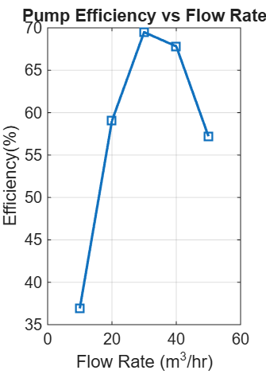
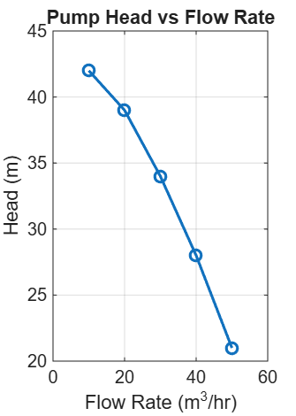
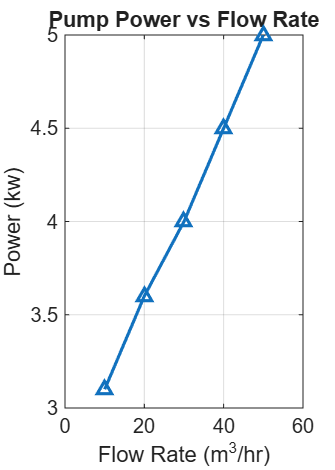

# Pump Performance Analysis Using MATLAB

## Project Overview
This project analyzes experimental pump test data to evaluate hydraulic performance, efficiency, and power consumption. The Best Efficiency Point (BEP) is identified to determine optimal pump operation.

## Methodology
- Imported experimental pump data into MATLAB
- Converted data to SI units
- Calculated pump efficiency using energy balance
- Generated standard pump performance curves
- Identified Best Efficiency Point (BEP)

## Results

### Efficiency vs Flow Rate

### Head vs Flow Rate

### Power vs Flow Rate

## Tools Used
- MATLAB
- Experimental pump data
